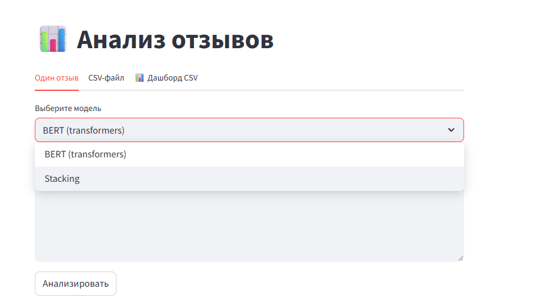
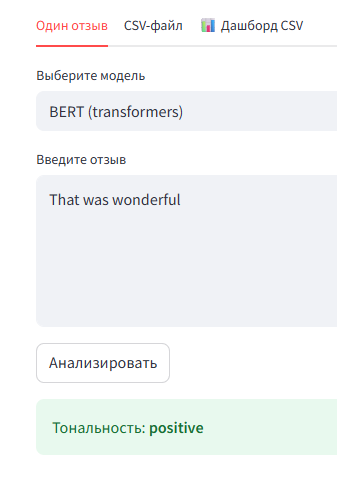
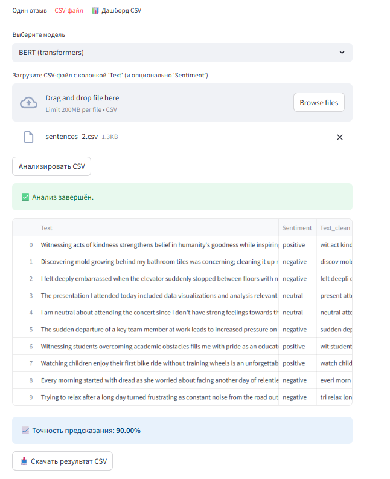
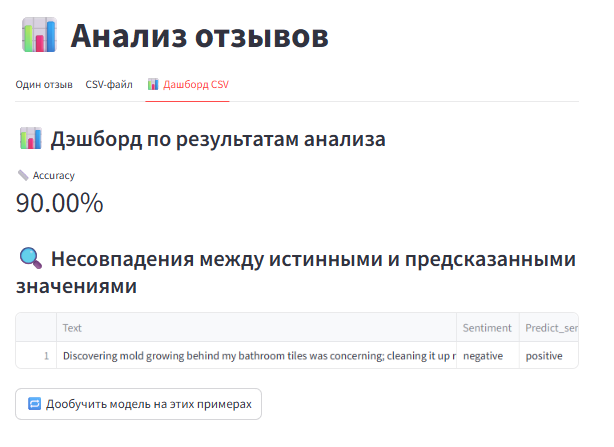
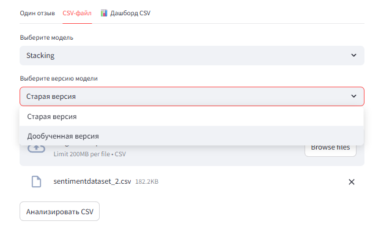

# Сентимент-анализ на основе BERT + FastAPI + Streamlit

Проект предназначен для анализа тональности текстов (позитивная / негативная / нейтральная) с использованием модели на основе Стекинга и  BERT. Включает:

- предобработку данных,
- обучение модели,
- FastAPI для REST-интерфейса,
- Streamlit-интерфейс для визуального ввода и анализа,

---
## 🧠 ВАЖНО! Выбор модели проекта, предобработка данных  описано по этой [ссылке в colab](https://colab.research.google.com/drive/1MvQyc-zyqIZR-Tt-OntliyVRmwtoDtfw?authuser=0#scrollTo=WhjjrVOH-Bz7)


## 📁 Структура проекта
<pre lang="markdown"> ``` 
├── app/
│ ├── main.py # FastAPI сервер
│ ├── utils_router.py # Утилита выбора модели и версий
│ ├── utils_b.py # Работа со стекингом
│ └── utils_bert.py # Работа с BERT моделью
├── src/
│ ├── data_pre_processing.py # Очистка и подготовка текстов
│ ├── train_model_bert.py # Обучение BERT модели
│ └── train_sent_model.py # Обучение с использованием Стекинга
├── data/
│ ├── Tweets.csv # Альтернативный датасет
│ └── sentimentdataset_2.csv# Основной  датасет
├── models/ # Сохранённые обученные модели
├── streamlit_app.py # Streamlit-интерфейс
├── test_main.http # Примеры API-запросов
├── .gitignore
└── README.md
``` </pre>

## Быстрый старт

### Установка зависимостей

```bash
pip install --upgrade pip
pip install -r requirements.txt
```
### Предобработка данных

```bash
 src/data_pre_processing.py встроена в процесс обучения
```
## Обучение модели
### Для обучения BERT-модели:

```bash
python src/train_model_bert.py
```
### Для обучения модели на основе стекинга:

```bash
python src/train_sent_model.py
```
После обучения модель будет сохранена в папке models/.

## 🌐 Запуск FastAPI

```bash
python -m uvicorn app.main:app --reload
```
- API доступно по адресу: http://127.0.0.1:8000

- Swagger: http://127.0.0.1:8000/docs

- Пример запроса — в test_main.http.

### API пример (test_main.http)

```http request
POST http://127.0.0.1:8000/predict
Content-Type: application/json

{
  "text": "I love this product!"
}
```

## Запуск Streamlit интерфейса
```bash
streamlit run .\streamlit_app.py
```
Откроется визуальный интерфейс для анализа введенного текста.

1. В первой закладке можно выбрать модель и ввести текстовый отзыв




2. На вкладке CSV предоставляется отправить на анализ csv файл и анализировать батч отзывов


Результаты можно просмотреть и скачать
Показатель точность предсказания будет подсчитан только для тех значений, 
где ранее в файле присутствовала колонка Sentiment

3. На третьей вкладке представлены несовпавшие результаты, также предоставляется возможность дообучить модель



4. После выполнения алгоритма дообучения появляется возможность на вкладке 2 выбрать новую или старую версию модели

